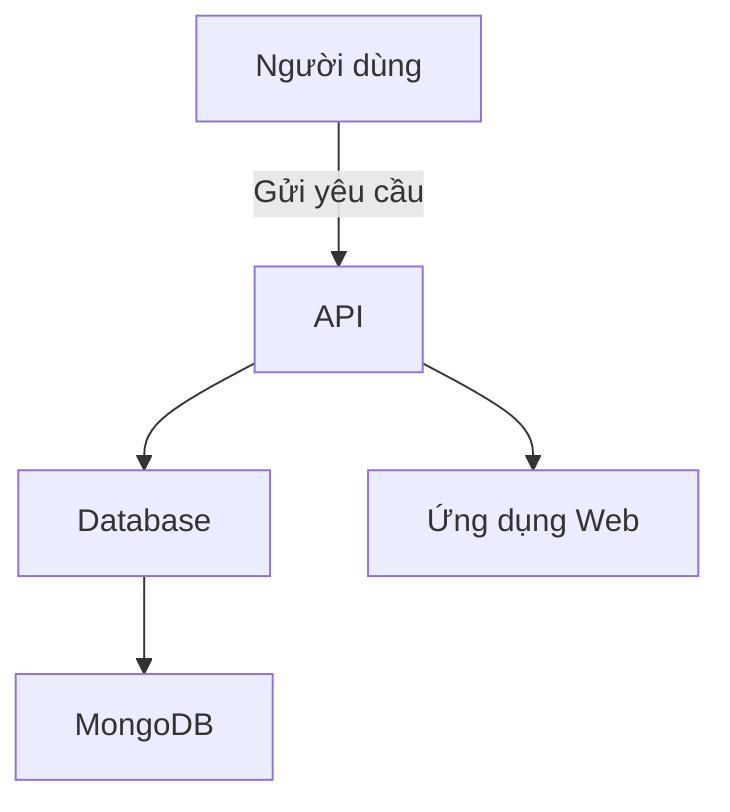

# Quản Lý Sinh Viên - Python và MongoDB

## Tóm tắt dự án
Dự án Quản Lý Sinh Viên được phát triển bằng Python và MongoDB nhằm mục đích giúp quản lý thông tin sinh viên một cách dễ dàng và hiệu quả. Dự án bao gồm các chức năng như thêm, sửa, xóa, và tra cứu thông tin sinh viên.

## Kiến trúc


## Tính năng
- Thêm thông tin sinh viên
- Cập nhật thông tin sinh viên
- Xóa thông tin sinh viên
- Tìm kiếm thông tin sinh viên
- Báo cáo thông tin sinh viên

## Hướng dẫn cài đặt
1. Cài đặt Python:
   - Tải Python từ [python.org](https://www.python.org/downloads/)

2. Cài đặt MongoDB:
   - Tải MongoDB từ [mongodb.com](https://www.mongodb.com/try/download/community)

3. Cài đặt các thư viện cần thiết:
   ```bash
   pip install -r requirements.txt
   ```

## Hướng dẫn sử dụng
- Khởi động ứng dụng:
   ```bash
   python app.py
   ```

- Truy cập ứng dụng qua trình duyệt tại: `http://localhost:5000`

## Lược đồ cơ sở dữ liệu
```plaintext
SinhVien {
    id: ObjectId,
    hoTen: String,
    namSinh: Date,
    diaChi: String,
    email: String
}
```

## Tài liệu API
### GET /sinhvien
- Lấy danh sách sinh viên

### POST /sinhvien
- Thêm sinh viên mới

### PUT /sinhvien/{id}
- Cập nhật thông tin sinh viên

### DELETE /sinhvien/{id}
- Xóa sinh viên

## Ví dụ
```json
{
  "hoTen": "Nguyễn Văn A",
  "namSinh": "2000-01-01",
  "diaChi": "Hà Nội",
  "email": "a@example.com"
}
```

---
Tạo bởi Nguyenthanh0511 vào 2025-11-30 14:56:28 UTC